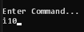

# MineSweepers_CSC1060X41 - Amir Gorkovchenko (Spring 2024)
MineSweeper V1. School Project CSC1060

Simply demonstrates the use and knowledge of the C++ language.

## Description
Console-Based version of the classic minesweeper Game

Allows user to choose a custom gameBoard size

User plays by selecting row column using alphanumerical coordinate system

Can save and load game session to/from an external file

## Use

The game board gives the user an alphabet along the x-axis and numbers along the y-axis

Each block can be targeted by typing an alphabetic character and a numerical value (order doesn't matter)

The game can be stored to a file and loaded from a file